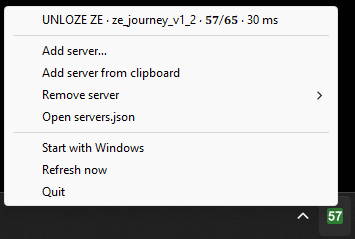

# CSS ZE Server Widget

A lightweight Windows system tray widget for CSS: ZE servers.

- The tray menu lists each server with its name, map, player count and ping.
- Click a server to join it. CSS launches through Steam if it isn't already running.
- Servers that are down stay in the list as offline and come back on their own.
- When an event starts, the icon flashes. It stays orange while the event is on.

<p>
  
  &nbsp;
  
  &nbsp;
  
</p>

## Download

**[Download CSS-ZE-Widget.exe](https://github.com/GillesVanHooff/CSS-ZE-Server-Widget/releases/latest/download/CSS-ZE-Widget.exe)**
(latest release; older versions are on the [releases page](https://github.com/GillesVanHooff/CSS-ZE-Server-Widget/releases)).

Put it in any folder and run it. You need Windows 10/11 and Steam with Counter-Strike: Source. Python isn't needed.

The `.exe` isn't signed, so the first time Windows shows "Windows protected your PC". Click **More info**,
then **Run anyway**.

## Requirements to run from source

- Windows 10/11
- Python 3.12+ from [python.org](https://www.python.org/downloads/) (not the Microsoft Store placeholder)
- Steam with Counter-Strike: Source installed

## Setup

```powershell
py -m venv .venv
.venv\Scripts\python.exe -m pip install -r requirements.txt
.venv\Scripts\python.exe main.py
```

Click the tray icon (left or right) to open the menu. The icon shows the total number of players on the
online servers. Hover over it to see players and capacity, for example `44/104`.

To check the servers without the tray, run `.venv\Scripts\python.exe query.py`.

## Build the .exe

```powershell
powershell -ExecutionPolicy Bypass -File build.ps1
```

This installs PyInstaller into the venv, draws the icon (`make_ico.py`) and writes
`dist\CSS-ZE-Widget.exe`. That one file is all you need, and it can go in any folder.

Unsigned single-file builds sometimes set off antivirus false positives.

### Publish a release

Push a version tag. GitHub Actions (`.github/workflows/release.yml`) then builds the `.exe` and publishes it
as a release, with the commits since the previous one as release notes:

```powershell
git tag v1.0.0
git push CSS-ZE-Server-Widget v1.0.0
```

Follow the run under the repo's **Actions** tab. It takes a few minutes.

To start the widget when you log in, tick **Start with Windows** in the tray menu. It adds the `.exe`'s
current location to your user's startup list. If you move the `.exe`, the item shows as unticked: tick it
again.

## Configuration

Add and remove servers from the tray menu:

- **Add server…** opens a small window for `IP:port` and an optional name. If the clipboard holds an
  address, the field is filled in already.
- **Add server from clipboard** adds the address you copied without opening a window. It accepts
  `1.2.3.4`, `1.2.3.4:27015`, `connect 1.2.3.4:27015` and `steam://connect/1.2.3.4:27015`.
- **Remove server** lists the servers. It asks before removing one.
- **Open servers.json** opens the list in Notepad. The widget picks up your changes on the next refresh,
  or right away with **Refresh now**.

The list is saved in `servers.json`:

- The `.exe` keeps it in `%APPDATA%\CSS-ZE-Widget\`, so it stays put when the `.exe` moves.
- Running from source, it's the one in the project folder.

If the file is missing, it's created with UNLOZE ZE. If a hand edit breaks it, the widget says so and keeps
the previous list. The optional `name` replaces the name the server reports.

```json
[
  { "name": "UNLOZE ZE", "ip": "51.195.188.106", "port": 27015 }
]
```

## How it works

The widget polls each server about every 30 seconds with Valve's A2S query protocol over UDP. Ping is
the measured round-trip time of the query. Clicking a server opens `steam://connect/IP:PORT`.
