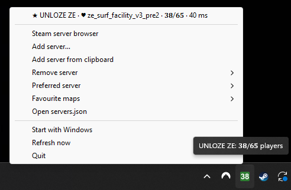
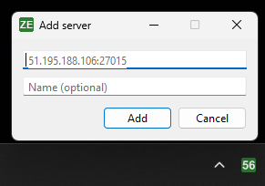
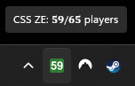
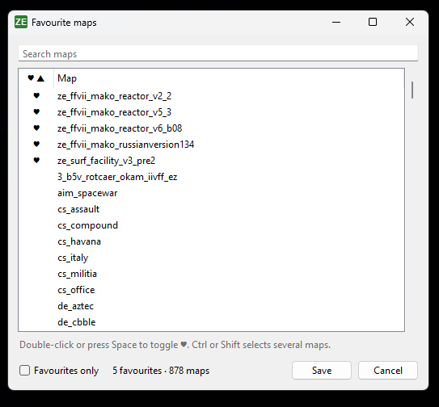
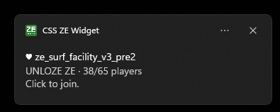

# CSS ZE Server Widget

A lightweight Windows system tray widget for CSS: ZE servers.

- The tray menu lists each server with its name, map, player count and ping.
- Click a server to join it. CSS launches through Steam if it isn't already running.
- **Steam server browser** in the menu opens Steam's server list, to find more servers to add.
- Servers that are down stay in the list as offline and come back on their own.
- When an event starts, the icon flashes. It stays orange while the event is on.
- Mark maps as favourites and get a Windows notification when a server switches to one. Click the
  notification to join.

<p>
  
  &nbsp;
  
  &nbsp;
  
</p>
<p>
  
  &nbsp;
  
</p>

## Download

**[Download CSS-ZE-Widget.exe](https://github.com/GillesVanHooff/CSS-ZE-Server-Widget/releases/latest/download/CSS-ZE-Widget.exe)**
(latest release; older versions are on the [releases page](https://github.com/GillesVanHooff/CSS-ZE-Server-Widget/releases)).

Put it in any folder and run it. You need Windows 10/11 and Steam with Counter-Strike: Source. Python isn't needed.

The `.exe` isn't signed, so the first time Windows shows "Windows protected your PC". Click **More info**,
then **Run anyway**.

**Notifications:** to be notified when a favourite map is played, Windows notifications must be on. If you
turned them all off, you don't have to get every app's notifications back. The settings have different names
on Windows 10 and 11:

| | Windows 11 | Windows 10 |
|---|---|---|
| Settings page | **System → Notifications** | **System → Notifications & actions** |
| Main switch | **Notifications** | **Get notifications from apps and other senders** |
| App list | **Notifications from apps and other senders** | **Get notifications from these senders** |

1. Open the settings page and turn on the main switch. Windows can't let a single app through while it's off.
2. In the app list below it, turn off the apps you don't want to hear from.
3. Leave **CSS ZE Widget** on. It's added to the list after its first notification. To get one right away,
   click **Refresh now** while a server is playing one of your favourite maps.

## Configuration

Add and remove servers from the tray menu:

- **Add server…** opens a small window for `IP:port` and an optional name. If the clipboard holds an
  address, the field is filled in already.
- **Add server from clipboard** adds the address you copied without opening a window. It accepts
  `1.2.3.4`, `1.2.3.4:27015`, `connect 1.2.3.4:27015` and `steam://connect/1.2.3.4:27015`.
- **Remove server** lists the servers. It asks before removing one.
- **Preferred server** picks one server for the icon. The icon then shows that server's players instead of
  the total, the server is listed first with a ★, and the tooltip shows both. Click it again to go back to
  the total.
- **Open servers.json** opens the list in Notepad. The widget picks up your changes on the next refresh,
  or right away with **Refresh now**.

The list is saved in `servers.json`:

- The `.exe` keeps it in `%APPDATA%\CSS-ZE-Widget\`, so it stays put when the `.exe` moves.
- Running from source, it's the one in the project folder.

If the file is missing, it's created with UNLOZE ZE. If a hand edit breaks it, the widget says so and keeps
the previous list. The optional `name` replaces the name the server reports, and `"preferred": true`
marks the preferred server.

```json
[
  { "name": "UNLOZE ZE", "ip": "51.195.188.106", "port": 27015, "preferred": true },
  { "ip": "1.2.3.4", "port": 27015 }
]
```

## Favourite maps

**Favourite maps** in the tray menu:

- **Edit favourites…** lists every map Counter-Strike: Source has downloaded, from all your Steam libraries,
  plus the maps the servers are playing now. Search, then double-click a map or press Space to toggle its ♥.
  Ctrl and Shift select several at once. **Favourites only** shows just your favourites.
- **Notify when one is played** turns the notifications on or off.

Favourite maps get a ♥ in the server list. A notification shows when a server switches to a favourite,
and once at startup if one is already on. **Refresh now** shows it again for any favourite that's on. Map names must match exactly, so `ze_example_v2` and
`ze_example_v3` are different maps. Notifications need Windows notifications turned on
(Settings → System → Notifications).

The favourites are saved in `favourites.json`, next to `servers.json`.

## How it works

The widget polls each server about every 30 seconds with Valve's A2S query protocol over UDP. Ping is
the measured round-trip time of the query. Clicking a server opens `steam://connect/IP:PORT`.
